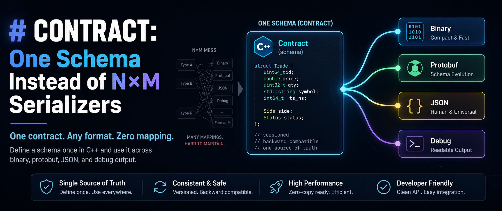

# CONTRACT: One Schema Instead of N×M Serializers

**One contract. Any format. Zero mapping.**

Any C++ project where data doesn't stay inside a single process sooner or
later runs into the same thing: the same struct needs to be shown in debug
output, written to a binary protocol, handed off via protobuf to an
external service, and logged as JSON. Without a shared mechanism, this
turns into a scatter of hand-written mappings for every type: `toJson`,
`toProto`, `debugPrint`, `writeBinary`. Every schema change has to be
synchronized by hand across all of them.

```text
N data classes × M formats = N×M hand-written mappings
```

We're not the only ones in C++ who've hit exactly this wall. Other
libraries address the same problem:
[reflect-cpp](https://github.com/getml/reflect-cpp) (C++20 reflection,
JSON/BSON/CBOR/msgpack/TOML/XML/YAML/Avro/Cap'n Proto and others),
[serde-cpp](https://github.com/GerHobbelt/serde-cpp) (inspired by Rust's
serde), and the older Boost.Serialization/Cereal. The
question is what CONTRACT actually adds on top of "one schema, many
formats," given that the idea itself isn't new.

## Not Just Another Serializer

CONTRACT solves N×M differently than a serialization library would:

```text
N contracts + M adapters
```

The schema is declared once, right in the C++ struct:

```cpp
struct Order {
    std::uint64_t id;
    std::string customer;
    double amount;
    bool paid;

    CONTRACT(Order,
        (id, 1),
        (customer, 2),
        (amount, 3),
        (paid, 4)
    )
};
```

`CONTRACT(...)` doesn't serialize anything by itself. It gives you a
stable list of fields: ID, name, type, traversal order. A serializer can
use that list, or something else entirely can: a validator, a schema
exporter, an audit dump. CONTRACT is not runtime reflection, not a
generic serializer, and not a schema-first code generator. The core is
responsible for what a field is and how to get to it, not for what it
should look like on the wire. That's already the adapter's job.

This is where CONTRACT and reflect-cpp differ: reflect-cpp
answers the question "how do I serialize a struct into N formats."
CONTRACT answers a different question: "how do I give a struct a stable
contract that serialization may use - or may not."

## Before / After

Without a shared schema, the `Order` from the example above would look
roughly like this:

```cpp
struct Order {
    std::uint64_t id;
    std::string customer;
    double amount;
    bool paid;

    std::string toJson() const {
        std::ostringstream out;
        out << "{\"id\":" << id
            << ",\"customer\":\"" << customer << "\""
            << ",\"amount\":" << amount
            << ",\"paid\":" << (paid ? "true" : "false") << "}";
        return out.str();
    }

    void debugPrint(std::ostream& out) const {
        out << "Order{id=" << id << ", customer=" << customer
            << ", amount=" << amount << ", paid=" << paid << "}";
    }

    void writeBinary(std::vector<std::uint8_t>& buf) const { /* ... */ }
};
```

Plus a separate `order.proto`, `protoc`, generated `.pb.h`/`.pb.cc`, and a
hand-written `toProto`/`fromProto` between `Order` and `OrderProto`. Four
formats - four places where you have to remember to make any schema
change.

With CONTRACT, `Order` is declared once (see above), and after that the
format is just a choice of adapter:

```cpp
contract::cout << order;
contract::adapters::json::to_string(order);
binary_out << order;
proto_out << order;
```

`Order` doesn't change at all in this code - only what you pass it
through changes.

The difference shows the other way too: adding a new field is one line
in `CONTRACT(...)`. In the "before" version, it's an edit in several
places at once: `toJson`, `debugPrint`, `writeBinary`, the `.proto` file,
and the hand-written `toProto`/`fromProto`. And it's easy to forget one
of them.

## What We Wanted From the Model

Even this simple example already shows a model broader than "one
declaration instead of N mappings." We wanted:

1. The contract to be a stable schema, declared once in the C++ type
   itself, independent of format:
   - ID
   - name
   - type
   - field access method.
2. A field to not need to be a physical struct member:
   - reuse a schema through inheritance (`BASE`)
   - compute a value on the fly (`PROPERTY`)
   - reference data the type doesn't own (`REFERENCE`).
3. Format and behavior to belong entirely to the adapter, not the core -
   serialization here is just one of the possible roles, not the only
   one:
   - serialization (protobuf, JSON, compact, binary, ...)
   - validation
   - schema export
   - audit dumping.
4. A separate attribute layer to sit on top of fields - policy that
   different adapters interpret each in their own way:
   - security
   - check
   - unit.
5. None of it to add excess runtime overhead.

## The Core of the Contract

At the base is what we wanted as the first point - a stable schema with
a field's ID, name, type, and access method. In practice, this is a
small compile-time API that everything else is built on top of:

```cpp
contract::field_count<Order>();                        // how many fields
contract::field_at<0, Order>();                        // field descriptor by index
contract::dispatch_field_by_id<Order>(2, fn);          // find a field by id
contract::dispatch_field_by_name<Order>("amount", fn); // same, by name
contract::type_name<Order>();                          // "Order"
```

A field descriptor carries the ID, name, and access method
(`get`/`set`/`ref`). That's enough for an adapter to build anything
around it, from a wire codec to a debug dump, without ever reaching
directly into the struct itself.

By the way, why an ID at all instead of just a name: it's not only about
wire size (a name is longer, slower to compare when packing) - the real
danger is elsewhere. If the same identifier, whether a name or a number,
gets reused for a field with an incompatible type, old and new code will
start interpreting the same bytes differently. For this case, a contract
can explicitly reserve an ID (`contract::schema::reserved_id(...)`) -
today that's a purely declarative marker; no adapter checks it yet.

## Contract Flexibility: BASE, PROPERTY, and REFERENCE

This is the second point: a field doesn't have to be a physical struct
member. CONTRACT has three mechanisms for that.

**`BASE(Type, offset)`** plugs another C++ type's contract in as part of
the current one, through regular inheritance, with an ID offset so the
base type's fields don't collide with the derived type's fields:

```cpp
struct Header {
    std::uint64_t request_id;

    CONTRACT(Header, (request_id, 1))
};

struct Event : public Header {
    std::string name;

    CONTRACT(Event,
        BASE(Header, 100),
        (name, 1)
    )
};
```

`Event` gets `request_id` at ID 101 (100 + 1) and its own `name` at ID 1.
The shared part of the schema is declared once in `Header` and reused,
rather than copied into every type that needs it.

**`PROPERTY(name, id, type)`** is a contract field with no physical
struct member behind it - instead there's a `contract_get`/`contract_set`
pair:

```cpp
struct Metric {
    std::uint32_t raw_count = 0;

    CONTRACT(Metric,
        (raw_count, 1),
        PROPERTY(doubled_count, 2, std::uint32_t)
    )

    std::uint32_t contract_get(const contract_fields::doubled_count&) const {
        return raw_count * 2;
    }

    void contract_set(const contract_fields::doubled_count&, std::uint32_t value) {
        raw_count = value / 2;
    }
};
```

Adapters see `doubled_count` as an ordinary field: they read and write
it the same way they do `raw_count`, even though no such field exists in
`Metric`'s memory at all. The value is computed on the fly through
`contract_get`/`contract_set`.

**`REFERENCE(name, id)`** is the third kind of field: a contract field
that references data the struct doesn't own. This mechanism is used in
CONTRACT's structured logger, so the value isn't copied on the hot path:

```cpp
template<class T>
struct payload_field {
    std::string_view name;
    const T& value;

    CONTRACT(payload_field,
        (name, 1),
        REFERENCE(value, 2)
    )
};
```

`value` is a reference, not a copy; the adapter reads it as an ordinary
contract field, but the log call doesn't pay for allocating or copying
the logged value.

## The Adapter Ecosystem

This is where the third point comes into play - format and behavior
belong to the adapter, not the core. CONTRACT currently has six adapter
families, and not all of them are symmetric on read/write. Below, in
decreasing order of significance and completeness:

| Adapter | Write | Read | Comment |
|---|---|---|---|
| protobuf | ✓ | ✓ | complete: wire-compatible with real protobuf, beats libprotobuf in 20/28 measurements ([separate article](protobuf-adapter-performance.md)) |
| binary | ✓ | ✓ | complete: native layout with no wire overhead, the fastest option - but not a cross-platform format by default |
| compact | ✓ | ✓ | complete: its own compact wire format, the only one today that actually skips unknown fields on read |
| JSON | ✓ | - | write-only, but with security modes (redact/omit) - structured logging is built on it |
| structured logging | ✓ | - | a thin layer on top of the JSON adapter for logs, not a separate wire format |
| console/debug | ✓ | - | human-readable debug output |
| YAML | - | ✓ | read-only: a strict config reader, not an export format - CONTRACT can't write YAML yet |

The architecture is the same across all of them: `contract` knows the
fields and their identity and knows nothing about format, `io` works
with bytes and a cursor. But `writer`/`reader` and `codec<T>` already
belong to a specific adapter and know its wire rules - each format has
its own.

## The Attribute Layer

The fourth point was a separate attribute layer on top of fields,
attached to a field in the list right next to its ID and interpreted by
each adapter in its own way. The set of vocabularies is extensible - a new
one can be added without touching the core; today `security` and `check`
actually work.

Take a typical authorization event with PII and a secret inside it:

```cpp
struct AuthEvent {
    std::string user_email;
    std::string access_token;
    std::uint64_t duration_ns;

    CONTRACT(AuthEvent,
        (user_email, 1, contract::security::sensitive()),
        (access_token, 2,
            contract::security::secret(),
            contract::security::no_log(),
            contract::security::encrypt()),
        (duration_ns, 3)
    )
};
```

The same `AuthEvent`, without a single `if` in the business logic,
behaves differently depending on the adapter. Console/debug and JSON
currently take `secret`/`no_log`/`sensitive` into account - each with
its own default - and the example below shows how to turn on the right
mode through `options`. In binary, `encrypt()` today is a key-based
obfuscation mechanism rather than cryptographic encryption. This kind of
per-field policy is
possible with ordinary serializers too (protobuf has its own field
options); what's different about CONTRACT is that the same attribute is
understood the same way by several independently implemented adapters -
not that it's fundamentally unreachable for the rest.

Here's what that looks like in a structured log (a simplified version of
`examples/logging.cpp`):

```cpp
struct SecretPayment {
    std::uint64_t order_id;
    std::string_view token;

    CONTRACT(SecretPayment,
        (order_id, 1),
        (token, 2, contract::security::secret()))
};

contract::logging::options opt{};
opt.json.secret = contract::adapters::json::security_mode::redact;
contract::logging::logger log{out, opt};

SecretPayment secret_payment{18, "tok_live_123"};
log.info("payment_sensitive", "Captured sensitive payment metadata",
    contract::logging::attribute("payment", secret_payment));
```

A fragment of the output (see `examples/logging.cpp` for the full line):

```json
{"name":"payment_sensitive","attributes":[{"name":"payment","value":{"order_id":18,"token":"<redacted>"}}]}
```

`token` went into the log as `"<redacted>"` because the calling code
decided so through `opt.json.secret`.

## Not at the Cost of Speed

And last, the fifth point: none of this should create extra runtime
overhead. One declaration instead of N×M is, first and foremost, about
convenience, but it doesn't come at the expense of performance: CONTRACT's
protobuf adapter was compared against real libprotobuf across 14
scenarios. CONTRACT came out faster in 20 measurements out of 28.
Details, methodology, and two clearly documented exceptions are in
[a separate article about the protobuf adapter](protobuf-adapter-performance.md).

## What CONTRACT Doesn't Do

So as not to create the impression that this is a solution for
everything:

- not runtime reflection - field traversal is unrolled at compile time.
- not a generic serializer - the format and its rules belong entirely to
  the adapter; the core doesn't choose or dictate a format.
- not a schema-first code generator - there's no separate schema file or
  generation step; the schema is the C++ struct itself.
- not a place for buffers, SQL, or third-party runtime code - that's the
  responsibility of a specific adapter, not the core.

## Example: A Config From YAML + Debug Output

Last but not least - real code from the repository
(`examples/yaml_file_read.cpp`): the same contract is read by the YAML
adapter and printed by the debug adapter.

```cpp
struct PaymentConfig {
    std::string service;
    std::uint32_t port = 0;
    bool enabled = false;
    std::vector<std::string> tags;

    CONTRACT(PaymentConfig,
        (service, 1),
        (port, 2),
        (enabled, 3),
        (tags, 4))
};

contract::adapters::yaml::reader<contract::io::file_buffer_input> in(
    contract::io::file_buffer_input{"payment_config.yaml"});

PaymentConfig config{};
in >> config;

contract::cout.debug() << config;
```

Given this `payment_config.yaml`:

```yaml
service: payment
port: 8080
enabled: true
tags:
  - api
  - payments
  - production
```

the output - taken from the built binary:

```text
PaymentConfig:
  service: "payment"  # #1 std::string
  port: 8080          # #2 u32
  enabled: true       # #3 bool
  tags:               # #4 std::vector<std::string>, size=3
    - "api"           # [0]
    - "payments"      # [1]
    - "production"    # [2]
```

The same `PaymentConfig`, the same contract. Each field's ID and type
make it into the output on their own, without a single line of code
written specifically for formatting.

## Why a Macro, Not C++26 Reflection

**Won't reflection eliminate the need for CONTRACT entirely?** C++26
reflection can enumerate a struct's members without a macro. That will
most likely genuinely simplify declaring and implementing the contract -
less hand-written text for enumerating physical fields. But the model
itself isn't going anywhere: CONTRACT still has to define what a stable
ID is that doesn't change across schema evolution (see above), what an
attribute-as-policy is (`security::secret()`, `schema::reserved_id()`),
and what counts as a field when there's no physical member behind it
(`PROPERTY`). And this doesn't touch the adapters at all: they've worked
with an already-assembled contract, and will keep working that way no
matter how the schema was declared - macro or reflection. Reflect-cpp
already shows today what plain reflection is missing for this model: it
has neither a stable ID, nor an attribute layer, nor computed fields.

**Aren't macros themselves just bad practice?** Partly fair: text
substitution with no scoping is a real cost. But we specifically fought
unreadable compile errors: make a typo and give two fields the same ID,
and you get a clear `static_assert`
(`"CONTRACT field ids must be unique after BASE offsets are applied"`),
not a page of template garbage. But `CONTRACT(...)` isn't a macro that
hides logic or control flow; it generates declarative field descriptors,
the same way `Q_OBJECT` does in Qt, `TEST(...)` does in gtest, or
`BOOST_DESCRIBE_STRUCT` does in Boost.Describe. And until static
reflection becomes mainstream, it's the most practical tool for
declaring a field's metadata once, in the C++ type itself.

## Bottom Line

The point of CONTRACT is simple: declare the schema once, next to the
type, and then do whatever you want with the data - write it to a binary
protocol or protobuf, read a config from YAML, print it to debug output
or a structured log - with no pile of service functions per task and no
hand-written per-format field mapping. And none of that costs you speed:
the adapters are fast.

That's the whole point, in the end: one contract, any format, zero
mapping.

Code - [github.com/antako76/Contract](https://github.com/antako76/Contract).
